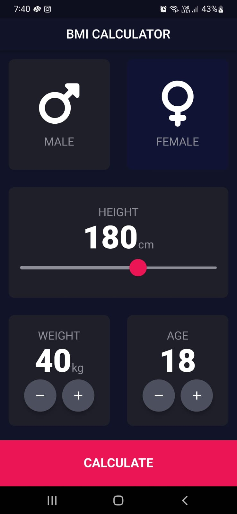
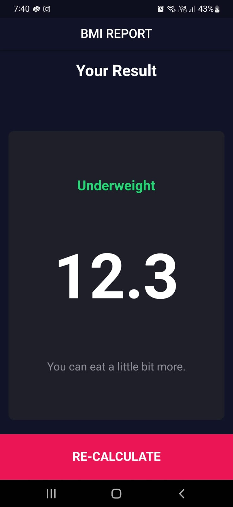
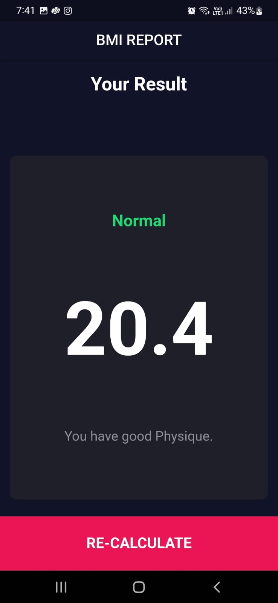
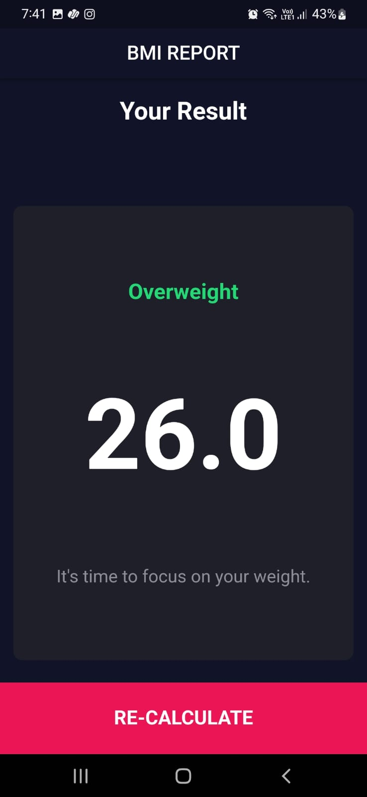

# Health-Machine


## Screenshots







BMI Calculator is a simple and user-friendly cross-platform application that helps you calculate your Body Mass Index (BMI) based on your height, weight, gender, and age. Whether you're tracking your health and fitness or just curious about your BMI, this app makes it easy to get the information you need.

## Features

- **BMI Calculation:** Enter your height, weight, gender, and age, and the app will calculate your BMI instantly.

- **Gender-Specific Calculations:** The app provides separate calculations for males and females, as BMI calculations can vary by gender.

- **Health Insights:** Get insights into what your BMI means for your health, including whether you are underweight, normal weight, overweight, or obese.

## Platforms Supported

BMI Calculator is a cross-platform application, available for:

- **iOS**
- **Android**

## Installation

To use the BMI Calculator app, follow these steps:

1. Clone this repository to your local machine:

```bash
git clone https://github.com/R0yalPrince/Health-Machine.git
cd Health-Machine
```

## Usage

- Enter your height in centimeters (cm) or feet and inches (ft).
- Enter your weight in kilograms (kg) or pounds (lb).
- Select your gender from the provided options.
- Enter your age.
- Click the "Calculate BMI" button to get your BMI and health information.

## Contributing

If you'd like to contribute to the development of BMI Calculator, please follow our [contributing guidelines](CONTRIBUTING.md).

## License

This project is licensed under the MIT License.

## Acknowledgments

We would like to express our gratitude to the open-source community for their contributions and inspiration.

---


